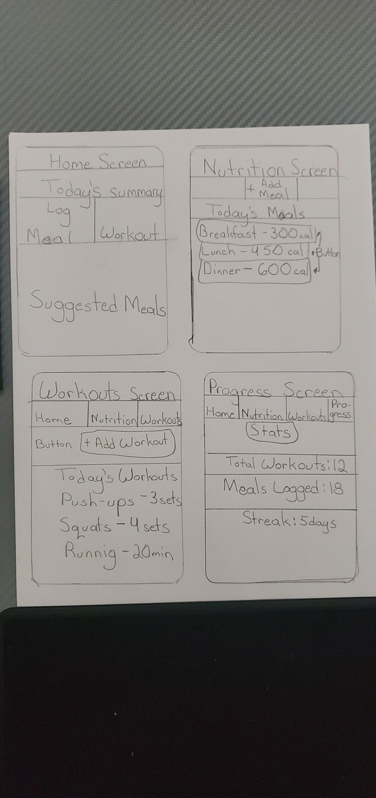
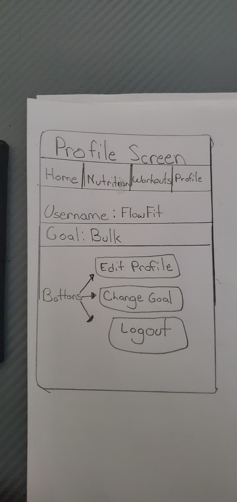

# FlowFit

## Table of Contents
- Overview
- Product Spec
- Wireframes
- Schema

---

## Overview

### Description

FlowFit is a fitness companion app designed to help users reach their health goals through a unified approach to nutrition and exercise. Instead of juggling multiple apps, FlowFit organizes all workout, weight‑loss, and nutrition information in one place.

The app uses a two‑pronged strategy:
1. **Nutrition:** FlowFit includes built‑in food tracking and simple calorie guidance, along with meal suggestions to help users stay in a calorie deficit (for fat loss) or surplus (for bulking).
2. **Exercise:** FlowFit provides workout recommendations, exercise lists, and visual references to help users perform workouts correctly and support muscle growth and overall fitness.

FlowFit is built for everyone—from beginners just starting their fitness journey to experienced lifters refining their training.

---

### App Evaluation

- **Category:** Health & Fitness
- **Mobile:** Primarily a mobile iOS application.
- **Story:** FlowFit guides users from scattered, unstructured fitness efforts to a clear, trackable plan that combines nutrition and workouts.
- **Market:** Anyone interested in improving their fitness—beginners, intermediate gym‑goers, and experienced athletes.
- **Habit:** Intended for daily or near‑daily use (logging meals, workouts, and checking progress).
- **Scope:** Focused but expandable. The MVP will cover core logging and suggestions, with room for future features like advanced analytics, social features, or AI‑driven recommendations.

---

## Product Spec
### 1. Sprint 1 User Stories
- [x] Set up Xcode project + navigation
- [ ] Build Home Screen UI
- [ ] Implement data model
- [ ] Build Detail Screen
- [ ] Add persistence
- [ ] Polish UI + constraints
- [ ] Prepare Unit 8 demo build
### 2. Sprint 2 – User Stories
- [x] Build Home Screen UI
- [x] Implement data model
- [x] Build Detail Screen
- [x] Add persistence
- [x] Polish UI + constraints
- [x] Prepare Unit 8 demo build
### 3. Sprint 3 – User Stories
- [x] Add App Icon
- [x] Polish UI + corrections
- [x] Implement data improvements
- [ ] Add onboarding / welcome flow
- [ ] Add loading & error states
- [ ] Add accessibility improvements

## Video Walkthrough

https://www.loom.com/share/9491f04e67d34a538764fe312807c2fb

    <a href="https://www.loom.com/share/9491f04e67d34a538764fe312807c2fb">
      
fiu-mobile-dev-group14/Flow_Fit - 6 April 2026 - Watch Video

    </a>
    
  

#### Required Must‑have Stories

- User can create an account and log in.
- User can set basic fitness goals (e.g., lose weight, maintain, gain muscle).
- User can log daily meals (simple entries with calories/macros or basic descriptions).
- User can log workouts (exercise name, sets, reps, weight, or duration).
- User can view a summary of their daily activity (meals + workouts).
- User can view a simple progress screen (e.g., streaks, total workouts, or weight trend if tracked).
- User can view suggested meals based on their goal (cutting/bulking/maintenance).
- User can view suggested workouts (e.g., beginner full‑body, push/pull/legs, cardio options).
- User can navigate between main sections using a tab bar (Home, Nutrition, Workouts, Progress, Profile).

#### Optional Nice‑to‑have Stories

- User can upload a profile picture.
- User can edit or delete past meal/workout entries.
- User can favorite specific meals or workouts.
- User can see simple charts (e.g., workouts per week, calories per day).
- User can customize workout plans (e.g., choose focus: strength, hypertrophy, endurance).
- User can receive motivational messages or tips on the home screen.
- User can filter workouts by muscle group or difficulty level.

---

### 2. Screen Archetypes

1. **Login / Signup Screen**
   - User can log in with existing credentials.
   - User can sign up for a new account.

2. **Onboarding / Goal Setup Screen (Optional but Recommended)**
   - User can select their primary goal (lose weight, maintain, gain muscle).
   - User can optionally enter basic info (weight, experience level).

3. **Home Screen**
   - User sees a quick summary of today’s activity (meals logged, workouts logged).
   - User sees their current goal and a simple motivational message.
   - Shortcuts to log a meal or log a workout.

4. **Nutrition Screen**
   - User can log a meal (name, calories, notes).
   - User can view a list of meals logged for the day.
   - User can view suggested meals based on their goal.

5. **Workouts Screen**
   - User can log a workout (exercise, sets, reps, weight or duration).
   - User can view a list of workouts logged for the day.
   - User can view suggested workouts (e.g., beginner full‑body, upper/lower split).
   - User can tap into an exercise to see a description and image/diagram.

6. **Progress Screen**
   - User can see basic stats (e.g., total workouts completed, days active, streaks).
   - User can see simple trends (e.g., workouts per week, meals logged per day).

7. **Profile / Settings Screen**
   - User can view and edit their profile info (name, goal).
   - User can log out.
   - (Optional) User can update their fitness goal.

---

### 3. Navigation

#### Tab Navigation (Tab to Screen)

- **Home** → Overview of today’s activity and quick actions.
- **Nutrition** → Meal logging and meal suggestions.
- **Workouts** → Workout logging and workout suggestions.
- **Progress** → Stats and simple trends.
- **Profile** → User profile and settings.

#### Flow Navigation (Screen to Screen)

- **Login / Signup**
  → Leads to **Home** after successful authentication.

- **Home**
  → Leads to **Nutrition** (e.g., “Log Meal” button).
  → Leads to **Workouts** (e.g., “Log Workout” button).
  → Leads to **Progress** via tab.
  → Leads to **Profile** via tab.

- **Nutrition**
  → Leads to **Add Meal** form.
  → Leads back to **Nutrition** list after saving.

- **Workouts**
  → Leads to **Add Workout** form.
  → Leads to **Exercise Detail** (for suggested workouts).
  → Leads back to **Workouts** list after saving.

- **Profile**
  → Leads to **Edit Profile / Goals**.
  → Leads back to **Profile** after saving.

---
## Wireframes

**Home, Nutrition, Workouts, Progress (combined)**  

**Profile Screen**  

                        

Suggested wireframes to create:

- **Login / Signup Screen**
- **Home Screen** (summary + quick actions)
- **Nutrition Screen** (meal list + add meal)
- **Workouts Screen** (workout list + add workout + suggested workouts)
- **Progress Screen** (basic stats)
- **Profile Screen**

You can sketch these on paper, take clear photos, and upload them to the repo (e.g., in a `wireframes/` folder), then reference them here.

---

### [BONUS] Digital Wireframes & Mockups

If time allows, you can create digital wireframes using tools like Figma, Sketch, or Canva and add them here as images.

---

### [BONUS] Interactive Prototype

If you build an interactive prototype (e.g., in Figma), you can add a GIF or link here.

---

## Schema

### Models

#### **User**

| Property      | Type    | Description                                  |
|---------------|---------|----------------------------------------------|
| objectId      | String  | unique id for the user (Parse default)       |
| username      | String  | unique username                              |
| password      | String  | user’s password (handled securely by Parse)  |
| goal          | String  | e.g., "cut", "maintain", "bulk"              |
| experience    | String  | e.g., "beginner", "intermediate", "advanced" |
| profileImage  | File    | optional profile picture                     |

#### **MealEntry**

| Property      | Type    | Description                                  |
|---------------|---------|----------------------------------------------|
| objectId      | String  | unique id for the meal entry                 |
| user          | Pointer | reference to `User`                          |
| name          | String  | meal name or description                     |
| calories      | Number  | estimated calories                           |
| notes         | String  | optional notes                               |
| date          | Date    | date/time of the meal                        |
| goalContext   | String  | e.g., "cut", "bulk", "maintain" (optional)   |

#### **WorkoutEntry**

| Property      | Type    | Description                                  |
|---------------|---------|----------------------------------------------|
| objectId      | String  | unique id for the workout entry              |
| user          | Pointer | reference to `User`                          |
| exerciseName  | String  | name of the exercise                         |
| sets          | Number  | number of sets                               |
| reps          | Number  | number of reps (if applicable)               |
| weight        | Number  | weight used (if applicable)                  |
| duration      | Number  | duration in minutes (for cardio)             |
| notes         | String  | optional notes                               |
| date          | Date    | date/time of the workout                     |

#### **SuggestedMeal** (Optional / Static or Seeded)

| Property      | Type    | Description                                  |
|---------------|---------|----------------------------------------------|
| objectId      | String  | unique id                                    |
| name          | String  | meal name                                    |
| calories      | Number  | approximate calories                         |
| goalType      | String  | "cut", "maintain", or "bulk"                 |

#### **SuggestedWorkout** (Optional / Static or Seeded)

| Property      | Type    | Description                                  |
|---------------|---------|----------------------------------------------|
| objectId      | String  | unique id                                    |
| name          | String  | workout or routine name                      |
| difficulty    | String  | e.g., "beginner", "intermediate"             |
| focus         | String  | e.g., "full body", "upper", "lower", "cardio"|
| description   | String  | short description                            |

---

### Networking

#### List of Network Requests by Screen

**Login / Signup Screen**
- `[POST] /users` — Create a new user (Parse sign‑up).
- `[POST] /login` — Log in existing user.

**Home Screen**
- `[GET] /mealEntries?user=current` — Fetch today’s meals.
- `[GET] /workoutEntries?user=current` — Fetch today’s workouts.
- (Optional) `[GET] /user` — Fetch user goal and basic info.

**Nutrition Screen**
- `[GET] /mealEntries?user=current&date=today` — Fetch today’s meals.
- `[POST] /mealEntries` — Create a new meal entry.
- `[DELETE] /mealEntries/:id` — Delete a meal entry (optional).
- `[GET] /suggestedMeals?goalType=user.goal` — Fetch suggested meals.

**Workouts Screen**
- `[GET] /workoutEntries?user=current&date=today` — Fetch today’s workouts.
- `[POST] /workoutEntries` — Create a new workout entry.
- `[DELETE] /workoutEntries/:id` — Delete a workout entry (optional).
- `[GET] /suggestedWorkouts?experience=user.experience` — Fetch suggested workouts.

**Progress Screen**
- `[GET] /workoutEntries?user=current` — Fetch historical workouts for stats.
- `[GET] /mealEntries?user=current` — Fetch historical meals (optional for trends).

**Profile Screen**
- `[GET] /user` — Fetch user profile.
- `[PUT] /user` — Update user goal/experience/profile info.

---

### Parse Network Snippets (Conceptual)

- **Sign Up User**
  - Create a `User` object and call `signUpInBackground`.
- **Log Meal**
  - Create a `MealEntry` object, set fields, and `saveInBackground`.
- **Log Workout**
  - Create a `WorkoutEntry` object, set fields, and `saveInBackground`.
- **Fetch Today’s Entries**
  - Query `MealEntry` or `WorkoutEntry` filtered by `user` and `date`.

(Exact Swift/Parse code will be implemented in the app.)

---
//
//  .ReadMe.md
//  FlowFit
//
//  Created by Vincent  on 4/1/26.
//t

